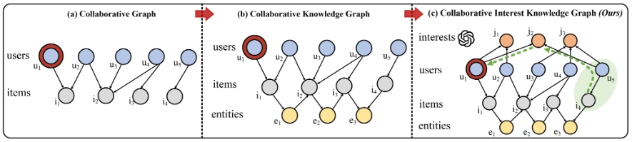
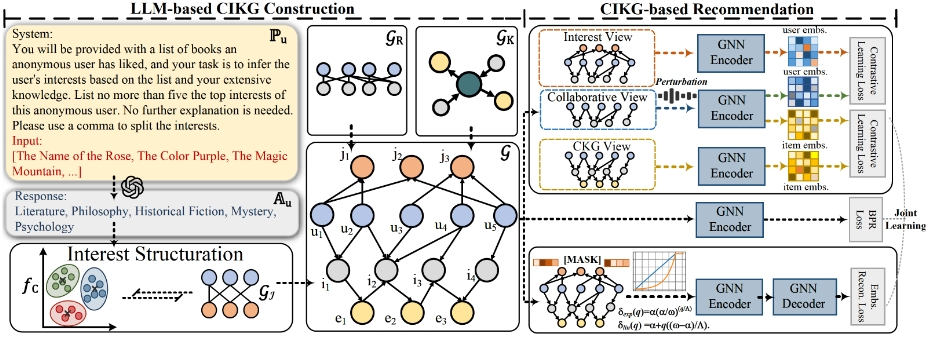

# CIKGRec: Bridging the User-side Knowledge Gap in Knowledge-aware Recommendations with Large Language Models
*This is the Torch implementation for our proposed GIKGRec (Accepted at AAAI 2025).*

## Introduction

In recent years, knowledge graphs have been integrated into recommender systems as item-side auxiliary information, enhancing recommendation accuracy. However, constructing and integrating structural user-side knowledge remains a significant challenge due to the improper granularity and inherent scarcity of user-side features. Recent advancements in Large Language Models (LLMs) offer the potential to bridge this gap by leveraging their human behavior understanding and extensive real-world knowledge. Nevertheless, integrating LLMgenerated information into recommender systems presents challenges, including the risk of noisy information and the need for additional knowledge transfer. In this paper, we propose an LLM-based user-side knowledge inference method alongside a carefully designed recommendation framework to address these challenges. Our approach employs LLMs to infer user interests based on historical behaviors, integrating this user-side information with item-side and collaborative data to construct a hybrid structure: the Collaborative Interest Knowledge Graph (CIKG). Furthermore, we propose a CIKGbased recommendation framework that includes a user interest reconstruction module and a cross-domain contrastive learning module to mitigate potential noise and facilitate knowledge transfer. We conduct extensive experiments on three real-world datasets to validate the effectiveness of our method. Our approach achieves state-of-the-art performance compared to competitive baselines, particularly for users with sparse interactions.

## Environment Requirement
Our experiments are conducted on Linux server with 24G TITAN RTX. The code has been tested under Python 3.8. The required packages are as follows:

* torch == 1.13.1
* torch-geometric == 2.3.1
* scikit-learn == 1.0.2
* sentence-trainsformers == 3.0.0
* prettytable == 3.10.0
* nltk == 3.8.1

## Quick Start
* To run the code:
```
python -u train.py --dataset book-crossing
```

This conmand will read the best hyperparameter setting of the corresponding dataset from `config` folder and languch the training process.

## Details of Important Files
The following outlines the structure of the repository and provides a brief explanation of each file or folder:

* `User_Interest_Generation_BatchMode.py`: Prepare the input file for LLM. We use the *batch mode* of OpenAI to speed up the inference process.
* `Structration_User_Knowledge.py`: Cluster the output of LLM into structural format.
* `train.py`: Train and evaluate the model (best model is selected based on the valid set).

## Data

* `train.txt/valid.txt/test.txt`: Preprocessed user-item interactions.
* `user_interest_clustered.txt`: PreProcessed user intrerest graph (The output of `Structration_User_Knowledge.py`).
* `kg_final.txt`: The Knowledge graph.
* `xx_list.txt`: *Original ID - Remap ID* projection file.

